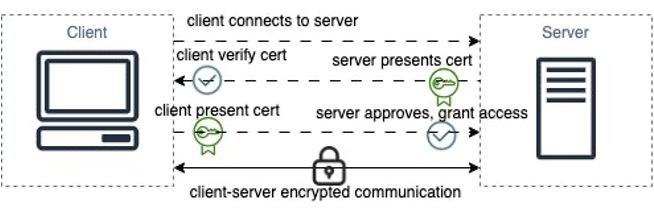
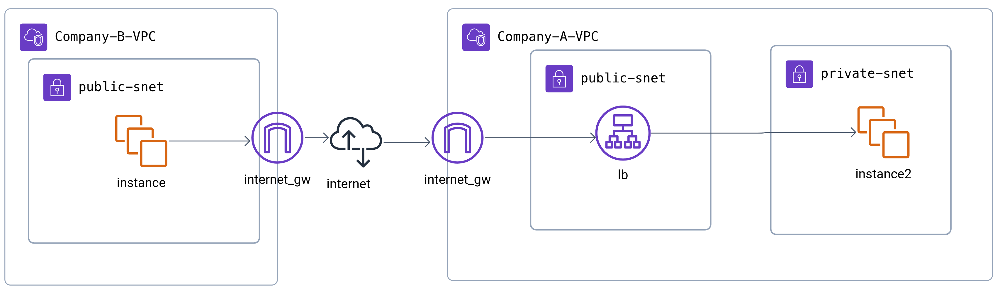

**Author** : Prabhmeet Deol

# Overview of How to Set Up mTLS in AWS
mTLS offers the ability to authenticate client devices over the public internet using a root CA. Additionally, it can be implemented in a completely private network with a private CA, providing encryption for east-west traffic and supporting a defense-in-depth strategy.

## Requirement
Typically, if organizations require encrypted service-to-service communication, they use mTLS over TLS to mutually authenticate both the client and the server.

This could also be used to authenticate services in a private Network or over AWS Private Link Fabric for Additional Authentication.

## Examples
1. A bank trying to authenticate a merchant's API before allowing a payment to be processed.
2. A hospital's microservice trying to authenticate an insurance provider's microservice.

## AWS Architecture

In the above example, we configure the mTLS certificate at the ALB, allowing only authenticated traffic for a distributed system. Additionally, the ALB can pass X.509 embedded certificate information as **X-Amzn-Mtls-\*** HTTP headers to downstream microservices for consumption.

## Security Advantages with IAM
The ALB can extract and pass client certificate details (e.g., subject, SAN) as HTTP headers (like X-Amzn-Mtls-*). This can be used to make routing decisions (to different applications or target groups), which can then be validated in downstream services for additional security.

Different target groups can be assigned different IAM roles, which can provide different information access levels (e.g., segmented data access to RDS or DynamoDB).

## AWS Config
1. Configure the ALB to use a Trust Store containing your client CA certificates.
2. Attach your server certificate to the ALB listener.
3. Enable mutual authentication (mTLS) on the ALB listener settings.
4. Optionally, configure rules to route traffic based on client certificate details.
5. Pass X.509 certificate information as HTTP headers to downstream services for further authorization or auditing.

## References
1. [AWS mTLS authentication on ALB](https://docs.aws.amazon.com/elasticloadbalancing/latest/application/mutual-authentication.html)
2. mTLS connection workflow image source: [AWS Blog - mTLS connection workflow](https://d2908q01vomqb2.cloudfront.net/fe2ef495a1152561572949784c16bf23abb28057/2024/02/01/mTLS-connection-workflow.jpg)
